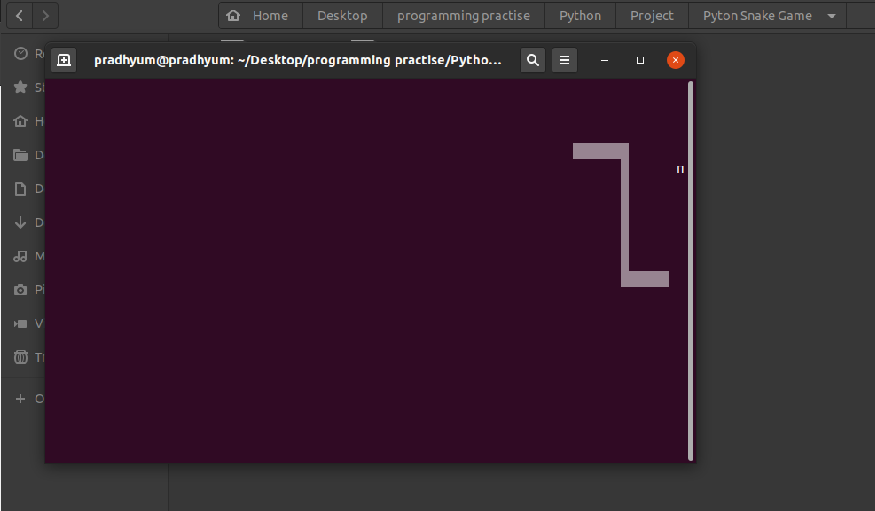
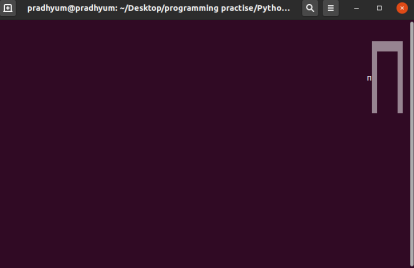

# Snake-Game

Snake Game in Python Programming Language


## How to download

Open your terminal or command Prompt and copy following text into them.

```bash 
git clone https://github.com/pradhyumvyas/Snake-Game.git
```
**Make sure you have already install git in your system. 


## Run This Game

Go to Directory Where this file are stored and open terminal then run following Command:-

```bash 
python Snake.py 
```


## Some ScreenShots of the Game
1.


2.
